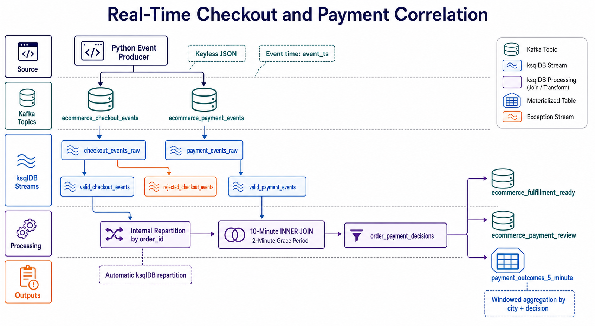

# Real-Time Checkout and Payment Correlation with ksqlDB

## Overview

This project implements a real-time e-commerce processing pipeline using
Confluent Cloud Kafka and ksqlDB. Checkout events and payment events are
published independently as JSON records. ksqlDB validates both event streams,
correlates matching records within an event-time window, evaluates payment
rules, routes each result to an operational topic, and maintains a windowed
summary of payment outcomes.

The implementation covers:

- Producing keyless JSON records to Confluent Cloud Kafka.
- Registering Kafka topics as ksqlDB streams.
- Assigning business timestamps to `ROWTIME`.
- Validating and standardizing streaming data.
- Retaining rejected checkout records with a rejection reason.
- Joining two streams by `order_id` within a 10-minute window.
- Allowing two minutes of grace for out-of-order events.
- Allowing ksqlDB to repartition keyless input streams internally.
- Routing successful and unsuccessful payment decisions separately.
- Building a five-minute windowed materialized table.

## Project Files

| File | Purpose |
|---|---|
| `ecommerce_event_producer.py` | Generates checkout and payment events and publishes them to Confluent Cloud Kafka. |
| `checkout_payment_windowed_join.sql` | Creates the complete ksqlDB processing pipeline. |
| `requirements.txt` | Lists the required Python packages. |
| `client.properties` | Contains the Confluent Cloud Kafka connection configuration. Keep this file private. |
| `checkout-payment-lineage.png` | Shows the complete end-to-end processing and data lineage. |

## End-to-End Flow



The diagram follows the complete record path: keyless producer events enter
the checkout and payment topics, become raw and validated streams, are
internally repartitioned by `order_id`, joined within the event-time window,
evaluated in `order_payment_decisions`, and routed to fulfillment, payment
review, and the five-minute materialized outcome table.

## Source Event Model

### Checkout events

Checkout records contain customer, product, quantity, price, discount,
currency, location, and sales-channel information. Product prices come from a
consistent catalogue. The producer calculates discounts from customer tiers:

| Customer tier | Discount |
|---|---:|
| `STANDARD` | 0% |
| `SILVER` | 5% |
| `GOLD` | 10% |

The expected payment amount is derived by ksqlDB:

```text
expected_amount = (quantity × unit_price) − discount_amount
```

### Payment events

Each generated checkout receives a corresponding payment containing the same
`order_id`, payable amount, and currency. The producer currently generates:

- 90% `AUTHORIZED` payments.
- 10% `FAILED` payments.
- Payment timestamps between 30 seconds and three event-time minutes after the
  checkout timestamp.
- Fraud scores between `0.02` and `0.40`.
- Failure reasons such as `BANK_DECLINED`, `INSUFFICIENT_FUNDS`, and
  `OTP_TIMEOUT` when a payment fails.

With these producer settings, the normal decisions are
`READY_FOR_FULFILLMENT` and `PAYMENT_NOT_AUTHORIZED`. The SQL also supports
`CURRENCY_MISMATCH`, `AMOUNT_MISMATCH`, and `HIGH_FRAUD_RISK` when such records
are received from another producer or introduced through controlled testing.

## Prerequisites

- A Confluent Cloud environment.
- A Kafka cluster and a ksqlDB cluster in the same environment.
- A Kafka API key and secret with permission to write to the source topics.
- Python 3.9 or later.

## Runbook

### 1. Open the project directory

```bash
cd <path-to-project>/KSQL_Window_Based_Ops
```

### 2. Create a Python virtual environment

```bash
python3 -m venv .venv
source .venv/bin/activate
python -m pip install -r requirements.txt
```

### 3. Configure the Confluent Cloud producer

Create `client.properties` in this directory with the Kafka cluster endpoint
and Kafka API credentials:

```properties
bootstrap.servers=<BOOTSTRAP_SERVER>:9092
security.protocol=SASL_SSL
sasl.mechanisms=PLAIN
sasl.username=<KAFKA_API_KEY>
sasl.password=<KAFKA_API_SECRET>
```

Do not commit this file or share its contents.

### 4. Start the ksqlDB pipeline

Open the Confluent Cloud ksqlDB editor and run sections 0 through 5 from
`checkout_payment_windowed_join.sql` in numerical order.

These statements:

1. Configure offset consumption.
2. Register or create the two source topics.
3. Start checkout and payment validation queries.
4. Start the windowed stream-stream join.
5. Start the fulfillment and review branches.
6. Create the windowed payment-outcomes table.

Persistent `CREATE STREAM AS SELECT` and `CREATE TABLE AS SELECT` statements
continue processing after the editor returns a query ID.

### 5. Start an observation query

Run one query at a time from section 6 of the SQL file. For example:

```sql
SELECT *
FROM order_payment_decisions
EMIT CHANGES;
```

A push query remains open and displays new results until it is cancelled.

### 6. Run the producer

From the project directory with the virtual environment activated:

```bash
python ecommerce_event_producer.py
```

The producer reads `client.properties` automatically. It sends plain JSON
values without Kafka keys to:

- `ecommerce_checkout_events`
- `ecommerce_payment_events`

The number of orders and the wall-clock delay are controlled by constants near
the top of `ecommerce_event_producer.py`:

```python
NUMBER_OF_ORDERS = 30
WAIT_BETWEEN_EVENTS_SECONDS = 1
```

### 7. Verify the outputs

Inspect the following streams or their backing Kafka topics:

| Output | Expected content |
|---|---|
| `order_payment_decisions` | Every checkout/payment pair matched within the join window and its calculated decision. |
| `fulfillment_ready_orders` | Authorized, matching, low-risk payments ready for inventory allocation. |
| `payment_review_orders` | Failed authorizations or other payment-rule failures. |
| `payment_outcomes_5_minute` | Counts, payment totals, and average fraud scores by city and decision. |
| `rejected_checkout_events` | Checkout records that failed input validation. |

Useful metadata commands are:

```sql
SHOW STREAMS;
SHOW TABLES;
SHOW QUERIES;
DESCRIBE checkout_events_raw EXTENDED;
DESCRIBE payment_events_raw EXTENDED;
```

### 8. Stop processing

- Press `Ctrl+C` to stop the Python producer. It flushes queued Kafka records
  before exiting.
- Cancel any active `EMIT CHANGES` query in the ksqlDB editor.
- Persistent queries continue running until explicitly terminated.

### 9. Reset the pipeline

Run `SHOW QUERIES;`, terminate this pipeline's persistent queries, and then use
the commented cleanup statements at the end of the SQL file in reverse
dependency order.

`DELETE TOPIC` permanently removes the backing Kafka topic and its data. Omit
it when only the ksqlDB metadata should be removed.

## Processing Details

### Event time

Both source streams declare `event_ts` as their timestamp column. ksqlDB uses
this field as `ROWTIME`, so the join and aggregation follow business-event time
instead of Kafka ingestion time.

The producer advances a logical event clock after each payment. This allows
minutes of event activity to be generated quickly while preserving monotonic
business timestamps.

### Keyless records and internal repartitioning

The producer does not set Kafka record keys. `order_id` is initially a JSON
value field, so matching checkout and payment records are not guaranteed to
arrive in corresponding source partitions.

The join condition is:

```sql
ON o.order_id = p.order_id
```

ksqlDB recognizes that the inputs are not keyed by the join column and creates
internal repartition topics when required. It repartitions both inputs using
`order_id`, which brings matching records to the same processing task. No
explicit user-defined `PARTITION BY` streams are required in this pipeline.

### Join semantics

The stream-stream join uses:

```sql
WITHIN 10 MINUTES
GRACE PERIOD 2 MINUTES
```

Only records with equal `order_id` values and event timestamps within the
10-minute boundary produce a joined result. The grace period permits limited
out-of-order arrival; it does not extend the 10-minute matching interval.

Because the query uses an `INNER JOIN`, an unmatched checkout or payment does
not appear in `order_payment_decisions`.

### Decision rules

Rules are evaluated in this order:

1. Payment status must be `AUTHORIZED`.
2. Checkout and payment currencies must match.
3. Expected and paid amounts may differ by no more than INR 1.
4. Fraud score must be below `0.80`.

Passing all rules produces `READY_FOR_FULFILLMENT`. The result is then routed
to either the fulfillment stream or the payment-review stream.

## Troubleshooting

### Producer cannot connect

- Confirm the `bootstrap.servers` endpoint.
- Confirm that the API key belongs to the Kafka cluster, not Schema Registry.
- Confirm `SASL_SSL` and `PLAIN` are configured.
- Confirm the API key has write access to both source topics.

### No joined records appear

- Confirm both source topics contain records with the same `order_id`.
- Confirm both `event_ts` values fall within 10 minutes.
- Confirm records pass the validation streams.
- Run `SELECT * FROM valid_checkout_events EMIT CHANGES;` and
  `SELECT * FROM valid_payment_events EMIT CHANGES;` separately.
- Check the ksqlDB processing log for serialization or timestamp errors.

### Existing data is processed again

The SQL sets `auto.offset.reset` to `earliest`, which is useful when source data
exists before the persistent queries are created. Use a new consumer/query
configuration when different replay behavior is required.
